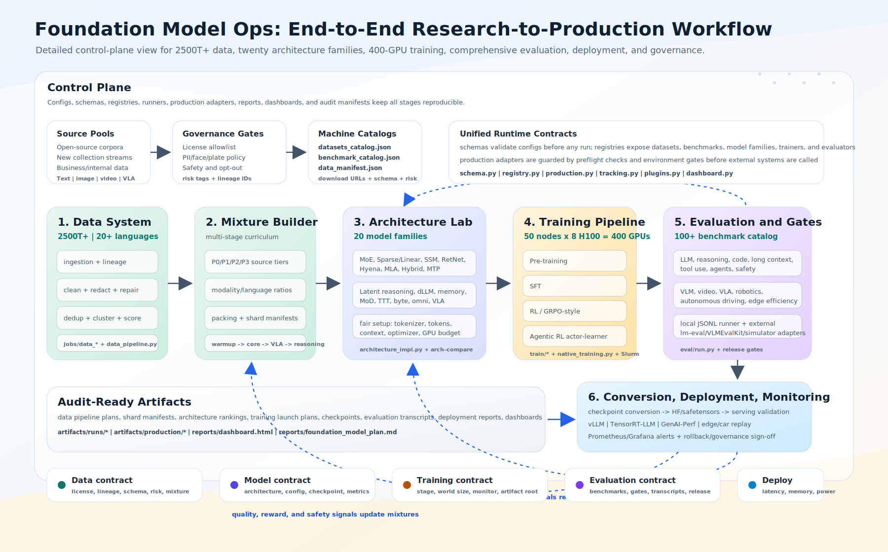

# Foundation Model Ops


这个工程把“下一代基础模型研发平台”的能力落成可运行、可校验、可审计的控制面：

1. 大规模训练数据体系：统一描述开源数据、新采集数据、业务数据，覆盖纯文本、多模态、视频预训练、音频/语音和 VLA 数据，内置清洗、去重、聚类、质量评估和多阶段配比校验。
2. 下一代模型结构实验：在统一 tokenizer、训练 token、上下文长度、优化器和 GPU 预算下，对 MoE、Sparse / Linear Attention、RNN-like Backbone、SSM / Selective Scan、Retention / RetNet、Long Convolution、MLA / KV-Compressed Attention、Hybrid、MTP、Latent Reasoning、dLLM、Memory-augmented、Mixture-of-Depths、Test-Time Memory、Token-free Byte-level LLM、Omni-modal、VLA / Robotics Transformer、JEPA / Latent World Model、Neuromorphic / Spiking Backbone、Reasoning-native 等二十类候选做公平对比。
3. 四百卡级训练 pipeline：覆盖 Pre-training、SFT、RL、Agentic RL，并把数据交接、分布式训练、稳定性监控、模型转换和部署验证写入统一配置。
4. 全面评测体系：覆盖通用能力、推理、多模态理解、音频/语音、VLA、长上下文、工具调用、Agent 能力和车端部署效率。

## 项目状态

这个仓库是控制面 reference，不是预训练模型发布。它的目标是让基础模型项目像成熟开源项目一样可复现、可检查：每个关键决策有配置文件，每个生产外部命令有 preflight，每个本地 smoke path 都能从干净 checkout 跑起来。

| 方向 | 状态 | 说明 |
| --- | --- | --- |
| 配置校验 | 可运行 | `fmops schema-validate` 和 `fmops validate` 覆盖全部 program config。 |
| 本地编排 | 可运行 | 数据、训练、评测、部署、dashboard、report、plugin、tracking 都能写本地 artifact。 |
| 本地训练 smoke | 可运行 | 安装可选 training extra 后，Pre-training、SFT、RL、Agentic RL 有轻量 PyTorch loop。 |
| 生产执行 | adapter 接入 | Spark、Ray、Slurm、评测 harness、checkpoint、监控和 serving 工具由 `production-check` 保护。 |
| 音频/语音 | 已建模并有 smoke | 数据、配比、benchmark catalog、release eval、JSONL smoke 样例已接入；完整 ASR/TTS/audio-language 训练通过外部后端接入。 |

## 支持模态

| 模态 | 数据覆盖 | 训练作用 | 评测作用 |
| --- | --- | --- | --- |
| 文本和代码 | web、书籍、论文、代码、数学、指令、偏好、agent trace | LM pretraining、SFT、RL、Agentic RL | 通用、推理、长上下文、工具、Agent |
| 图像/文档多模态 | 图文、OCR、VQA、文档、图表、diagram | VLM pretraining 和 instruction alignment | VLM、OCR、图表、文档 QA |
| 视频 | video-language、egocentric video、driving video | 时序和视频语言对齐 | 视频问答、时序推理、长视频 |
| 音频/语音 | ASR、speech translation、TTS、audio caption、speaker、noise/enhancement | 语音/音频 adapter 预训练、spoken instruction tuning、语音翻译、TTS/增强 handoff | WER/CER、BLEU、audio caption、speaker EER/DER、MOS |
| VLA/action | 机器人、具身、自动驾驶、仿真 | action-policy imitation、RL、Agentic RL | task success、action error、安全、closed-loop replay |

## 整体流程图



这张图展示从数据治理、清洗去重聚类、质量评估、多阶段配比、架构公平对比、四百卡训练、评测门禁、checkpoint 转换、部署验证到监控反馈的完整闭环。

## 快速开始

不需要安装额外依赖，直接用标准库运行：

```bash
PYTHONPATH=src python -m fmops.cli validate
PYTHONPATH=src python -m fmops.cli schema-validate
PYTHONPATH=src python -m fmops.cli registry
PYTHONPATH=src python -m fmops.cli datasets --priority P0
PYTHONPATH=src python -m fmops.cli datasets --modality audio
PYTHONPATH=src python -m fmops.cli benchmarks --dimension vla
PYTHONPATH=src python -m fmops.cli benchmarks --dimension audio_speech
PYTHONPATH=src python -m fmops.cli data-run
PYTHONPATH=src python -m fmops.cli train-run --stage SFT
PYTHONPATH=src python -m fmops.cli eval-run --model-id reference-model
PYTHONPATH=src python -m fmops.cli deploy-check
PYTHONPATH=src python -m fmops.cli plugins
PYTHONPATH=src python -m fmops.cli dashboard --output reports/dashboard.html
PYTHONPATH=src python -m fmops.cli data-plan
PYTHONPATH=src python -m fmops.cli arch-compare
PYTHONPATH=src python -m fmops.cli train-plan
PYTHONPATH=src python -m fmops.cli eval-plan
PYTHONPATH=src python -m fmops.cli report --output reports/foundation_model_plan.md
PYTHONPATH=src python -m fmops.cli production-plan
PYTHONPATH=src python -m fmops.cli production-check
PYTHONPATH=src python -m fmops.cli production-run --area monitoring
```

生产执行有双重保护：只有同时传入 `--execute` 且设置 `FMOPS_ALLOW_PRODUCTION_EXECUTE=1` 时，才会真正调用 Spark、Ray、Slurm、评测 harness 或部署压测工具。`production-check` 会先列出缺失的二进制和环境变量。

本地真实 PyTorch 训练 smoke test：

```bash
PYTHONPATH=src python train/pretrain.py --mode native --max-steps 2 --batch-size 2 --seq-len 64
PYTHONPATH=src python train/sft.py --mode native --max-steps 2 --batch-size 2 --seq-len 64
PYTHONPATH=src python train/rl.py --mode native --max-steps 2 --batch-size 2 --seq-len 64
PYTHONPATH=src python train/agentic_rl.py --mode native --max-steps 2 --batch-size 2 --seq-len 64
```

运行测试：

```bash
PYTHONPATH=src python -m unittest discover -s tests
```

## 配置说明

- `configs/data_manifest.json`：2500T+ 数据源、20+ 语言覆盖、处理阶段和多阶段数据配比，必需模态包含纯文本、多模态、视频预训练、音频/语音和 VLA。
- `configs/datasets_catalog.json`：机器可读的数据集 registry，包含下载链接、license、schema、模态、优先级和风险标签。
- `configs/benchmark_catalog.json`：机器可读的评测 benchmark registry，包含维度、模态、指标、harness、下载链接和 license 备注。
- `configs/architecture_experiments.json`：统一实验设置、结构候选、核心指标和综合排序。
- `configs/training_pipeline.json`：50 节点 x 8 卡的 400 GPU 训练流水线。
- `configs/evaluation_suite.json`：按能力维度组织的评测基准、权重和发布门禁。
- `configs/production_integration.json`：生产级接入任务图，覆盖数据湖、分布式训练、评测 harness、checkpoint 转换、部署验证、监控告警和发布门禁。

生成的 `reports/foundation_model_plan.md` 可以作为研发计划基线；生产执行计划和 preflight 报告输出在 `artifacts/production/`。

## 成熟框架补充

这一版已经补齐框架内核，不再只是配置和文档：

- `src/fmops/schema.py`：配置 schema、版本校验和轻量 migration 入口。
- `src/fmops/registry.py`：模型、数据集、trainer、evaluator 的统一 registry，模型 registry 已挂载二十类架构 reference implementation。
- `src/fmops/dataset_catalog.py`：机器可读数据集 catalog，支持 family/modality/priority 过滤和风险统计。
- `src/fmops/benchmark_catalog.py`：机器可读 benchmark catalog，支持 dimension/modality/harness 过滤和覆盖统计。
- `src/fmops/data_pipeline.py`：数据处理流水线 dry-run，输出 stage artifact、source count、operation count 和 lineage URI。
- `src/fmops/training_runner.py`：Pre-training、SFT、RL、Agentic RL 的统一 dry-run launcher。
- `src/fmops/native_training.py`：真实 PyTorch 训练后端，覆盖 Pre-training、SFT、RL、Agentic RL，输出 checkpoint、metrics 和 trainer state。
- `src/fmops/production.py`：生产 adapter 计划、preflight、受保护执行和审计报告。
- `jobs/data_ingest.py`、`jobs/data_quality.py`、`jobs/data_mixture.py`：生产数据湖接入 wrapper，覆盖 ingestion、清洗、去重、聚类、质量和配比 materialization。
- `jobs/training_launch.py`：四百卡 Slurm 训练提交 wrapper，覆盖 Pre-training、SFT、RL、Agentic RL。
- `jobs/evaluation_launch.py`：lm-eval、VLMEvalKit/OpenCompass、simulator/Agent/VLA 评测接入 wrapper。
- `jobs/checkpoint_convert.py`、`jobs/deployment_validate.py`：checkpoint serving conversion 和 vLLM/TensorRT-LLM/GenAI-Perf 部署验证 wrapper。
- `jobs/monitoring_export.py`、`jobs/release_gate.py`：Prometheus/Grafana 告警包和发布门禁聚合。
- `train/pretrain.py`、`train/sft.py`、`train/rl.py`、`train/agentic_rl.py`：四阶段训练入口，支持本地 `dry-run`、真实本地 `native` 训练和生产 `external` 分发；生产模式读取 `FMOPS_PRETRAIN_BACKEND_COMMAND`、`FMOPS_SFT_BACKEND_COMMAND`、`FMOPS_RL_BACKEND_COMMAND`、`FMOPS_AGENTIC_RL_BACKEND_COMMAND` 或通用 `FMOPS_TRAINING_BACKEND_COMMAND`。
- `src/fmops/evaluation_runner.py` 和 `eval/run.py`：真实本地评测 runner，读取 JSONL 样本/预测、调用外部模型命令或 HTTP endpoint、计算指标并输出可追踪 JSON report；已支持 WER/CER、speaker EER、DER、MOS 等音频/语音指标。
- `src/fmops/checkpoint.py`：checkpoint conversion manifest，支持训练格式到推理格式的元数据转换和可选文件复制。
- `src/fmops/deployment.py`：服务端/车端部署 envelope 检查，包括 latency、memory、decode throughput、power。
- `src/fmops/tracking.py`：实验 run manifest，记录配置引用、artifact、metric 和运行环境。
- `src/fmops/plugins.py`：本地插件发现和加载；`plugins/example_evaluator/plugin.json` 是可加载示例。
- `src/fmops/dashboard.py`：生成静态 HTML dashboard，聚合数据规模、结构排序、评测权重和校验状态。
- `.github/workflows/ci.yml`：CI 骨架，覆盖配置校验和核心测试。
- `Makefile`：常用命令入口，包含 `make validate`、`make test`、`make report`、`make dashboard`。

示例：

```bash
make validate
make data-run
make train-run
make eval-run
make deploy-check
make production-plan
make production-check
make dashboard
```

## 实现覆盖矩阵

| 需求模块 | 已实现的配置和代码 | 可运行入口 |
| --- | --- | --- |
| 2500T+ 大规模数据体系，覆盖开源、新采集和业务数据 | `configs/data_manifest.json`、`configs/datasets_catalog.json`、`src/fmops/data.py`、`src/fmops/data_pipeline.py`、`src/fmops/dataset_catalog.py`、`jobs/data_ingest.py`、`jobs/data_quality.py`、`jobs/data_mixture.py` | `fmops data-plan`、`fmops datasets`、`fmops data-run`、`production-plan --area data`、`production-check --area data` |
| 清洗、去重、聚类、质量评估、lineage、污染检查和多阶段配比 | `configs/data_manifest.json` 中的数据操作图，`configs/production_integration.json` 中的生产数据任务，`DataPipelineRunner` 的 lineage artifact | `fmops data-run`、`python jobs/data_quality.py`、`python jobs/data_mixture.py`、受保护的 `production-run --area data` |
| LLM/VLM/视频/音频/VLA 数据集和下载链接 | 英文主 README、`README.zh-CN.md` 的数据目录，机器可读 `configs/datasets_catalog.json` | `fmops datasets --priority P0`、`fmops datasets --family VLA-robotics`、`fmops datasets --modality audio`、`fmops datasets --modality video` |
| 二十类下一代模型结构和公平对比 | `configs/architecture_experiments.json`、`src/fmops/architecture_impl.py`、`src/fmops/architectures.py`、`src/fmops/registry.py`、`tests/test_architecture_impl.py` | `fmops registry`、`fmops arch-compare`、`python -m unittest discover -s tests -p "test_architecture_impl.py"` |
| 四百卡 Pre-training、SFT、RL、Agentic RL 训练 pipeline | `configs/training_pipeline.json`、`src/fmops/training_runner.py`、`src/fmops/native_training.py`、`train/pretrain.py`、`train/sft.py`、`train/rl.py`、`train/agentic_rl.py`、`jobs/training_launch.py` | `fmops train-plan`、`fmops train-run`、快速开始里的 native smoke 命令、受保护的 `production-run --area training` |
| 真实评测体系和 benchmark catalog，包含音频/语音 gate | `configs/evaluation_suite.json`、`configs/benchmark_catalog.json`、`src/fmops/evaluation.py`、`src/fmops/evaluation_runner.py`、`src/fmops/benchmark_catalog.py`、`eval/run.py`、`eval/smoke/*`、`jobs/evaluation_launch.py` | `fmops eval-plan`、`fmops benchmarks --dimension audio_speech`、`fmops eval-run`、`python eval/run.py --samples-dir ...`、受保护的 `production-run --area evaluation` |
| Checkpoint 转换、部署验证、监控、治理和发布门禁 | `src/fmops/checkpoint.py`、`src/fmops/deployment.py`、`src/fmops/production.py`、`jobs/checkpoint_convert.py`、`jobs/deployment_validate.py`、`jobs/monitoring_export.py`、`jobs/release_gate.py` | `fmops checkpoint-convert`、`fmops deploy-check`、`fmops production-plan`、`fmops production-check`、受保护的 `fmops production-run` |
| 成熟框架内核 | `src/fmops/schema.py`、`src/fmops/tracking.py`、`src/fmops/plugins.py`、`src/fmops/dashboard.py`、测试、CI、Makefile | `fmops schema-validate`、`fmops track-run`、`fmops plugins`、`fmops dashboard`、`make validate`、`make test` |

## 生产级接入

生产级接入已经落在 `configs/production_integration.json`、`src/fmops/production.py` 和 `jobs/*` wrapper 中。它覆盖：

- 数据：Spark/Ray 数据湖 ingestion、清洗、去重、聚类、质量评分、污染检查和多阶段配比 materialization。
- 训练：Slurm 四百卡提交，覆盖 Pre-training、SFT、RL、Agentic RL，并写出 sbatch 脚本、环境、world size、gate 和 checkpoint root。
- 评测：lm-eval、VLMEvalKit/OpenCompass、ESPnet/SpeechBrain/NeMo 风格音频/语音评测、simulator/Agent/VLA adapter，统一接入 `configs/evaluation_suite.json` 的 benchmark/gate。
- Checkpoint：训练 checkpoint 到 HF/safetensors serving artifact 的转换审计。
- 部署：vLLM、TensorRT-LLM、GenAI-Perf、车端 replay 的部署 envelope 检查。
- 监控：Prometheus alert rules、Grafana dashboard 元数据、SLO。
- 治理：数据、训练、评测、部署、安全、隐私和 rollback 发布门禁。

生产执行推荐流程：

```bash
make validate
make test
make production-plan
make production-check
FMOPS_ALLOW_PRODUCTION_EXECUTE=1 PYTHONPATH=src python -m fmops.cli production-run --execute
```

当前开发机如果没有 Spark、Slurm、lm-eval、vLLM 等外部依赖，`production-check` 会把对应任务标记为 blocked。这是保护行为，不是配置失败。

## 音频/语音训练计划

音频/语音已经进入数据配比、数据集 catalog、benchmark catalog、release evaluation 和 smoke 样例。当前仓库的本地 `native` trainer 仍保持轻量文本优先；完整 ASR、TTS、speech translation、audio-language、speaker、enhancement 训练建议通过 ESPnet、SpeechBrain、NVIDIA NeMo、fairseq、torchaudio 或内部训练栈以 external backend 方式接入。

| 阶段 | 数据族 | 目标 | 常用指标 |
| --- | --- | --- | --- |
| 声学自监督预训练 | LibriLight、VoxPopuli、MLS、Common Voice unlabeled、内部授权语音 | 学习稳健 speech/audio encoder 和 codec 对齐表征 | masked prediction loss、SUPERB/HEAR transfer |
| ASR 和多语种识别 | LibriSpeech、Common Voice、MLS、GigaSpeech、AISHELL、WenetSpeech、FLEURS | 跨口音、跨领域、跨语言 speech-to-text 对齐 | WER、CER、per-language macro average |
| 语音翻译 | CoVoST 2、MuST-C、FLEURS、Europarl-ST、内部平行语音 | audio-to-text translation 和 spoken multilingual interaction | BLEU、COMET、source WER |
| 音频语言理解 | AudioSet、AudioCaps、Clotho、MusicCaps、WavCaps、AVQA | audio caption、事件推理、audio QA、audio-video grounding | accuracy、F1、CIDEr、CLAPScore |
| 说话人和分离/分段 | VoxCeleb、AMI、LibriCSS、CALLHOME-style 授权数据 | speaker verification、diarization、meeting understanding | EER、DER、JER |
| TTS 和语音生成 | LJSpeech、VCTK、LibriTTS、CSS10、M-AILABS、内部授权 voice | text-to-speech、voice consistency、spoken assistant output | MOS、UTMOS、speaker similarity、intelligibility WER |
| 增强和鲁棒性 | MUSAN、DNS Challenge、CHiME、noise/reverb augmentation | noisy speech robustness、denoising、far-field speech | PESQ、STOI、DNSMOS、noise WER |

## 评测入口

```bash
PYTHONPATH=src python eval/run.py \
  --config-dir configs \
  --model-id reference-model \
  --output artifacts/runs/evaluation_report.json
```

当前 runner 已经是真实本地评测器：默认读取 `eval/smoke` 的 JSONL 样本，计算指标、执行 gate，并在 report 旁写出每个 benchmark 的 transcript。也可以接入真实样本、预测文件、外部模型命令或 HTTP endpoint：

```bash
PYTHONPATH=src python eval/run.py \
  --samples-dir /path/to/eval-jsonl \
  --predictions /path/to/predictions.jsonl \
  --benchmark general_multilingual_core \
  --output artifacts/runs/evaluation_report.json

PYTHONPATH=src python eval/run.py \
  --samples-dir /path/to/eval-jsonl \
  --model-command "python serve_one_sample.py" \
  --fail-on-gate
```

JSONL 样本支持 `id`、`benchmark`、`dataset`、`prompt`/`question`、`answer`/`reference`、`choices`、`prediction`，以及 `audio_uri`、`audio_duration_s`、`source_language`、`target_language`、`speaker_id`、`expected_tool`、`reference_action`、`success`、`collision_free`、`prefill_ms`、`decode_tok_s`、`memory_gb`、`power_w` 等任务字段。音频/语音分数可以放在 `scores` 中，例如 `wer`、`cer`、`bleu`、`caption_cider`、`clap_score`、`speaker_eer`、`der`、`mos`。

## 评测 Benchmark 目录

`configs/evaluation_suite.json` 保存发布评测分组、权重、指标、执行频率和 gate。`configs/benchmark_catalog.json` 是机器可读的全面 benchmark catalog，包含 100+ 个公开 benchmark 的维度、模态、指标、harness、下载链接和 license 备注。下面是接入真实评测 adapter 时使用的人类可读目录。公开 benchmark 适合做横向可比性；正式发布还需要私有、去污染、多语言、多模态、VLA 和车端 replay holdout。

### 评测 Harness

| Harness | 覆盖范围 | 链接 |
| --- | --- | --- |
| EleutherAI LM Evaluation Harness | 文本 LLM、few-shot、语言建模、QA、推理和大量公开 benchmark adapter。 | [lm-evaluation-harness](https://github.com/EleutherAI/lm-evaluation-harness) |
| HELM | scenario-based model evaluation，覆盖鲁棒性、校准、公平性、毒性和透明度报告。 | [stanford-crfm/helm](https://github.com/stanford-crfm/helm) |
| OpenCompass | LLM/VLM 评测平台，覆盖中英、多语言、推理、代码和多模态 benchmark。 | [open-compass/opencompass](https://github.com/open-compass/opencompass) |
| LightEval | Hugging Face 轻量 LLM 评测框架。 | [huggingface/lighteval](https://github.com/huggingface/lighteval) |
| VLMEvalKit | VLM 评测工具，覆盖图片、文档、OCR、图表、视频和多模态推理。 | [open-compass/VLMEvalKit](https://github.com/open-compass/VLMEvalKit) |
| lmms-eval | 大多模态模型评测 harness，覆盖图片、视频和多图任务。 | [EvolvingLMMs-Lab/lmms-eval](https://github.com/EvolvingLMMs-Lab/lmms-eval) |
| ESPnet | 端到端语音处理工具，覆盖 ASR、speech translation、TTS、enhancement、diarization 和大量 recipe。 | [espnet/espnet](https://github.com/espnet/espnet) |
| SpeechBrain | PyTorch 语音工具，覆盖 ASR、speaker、enhancement、separation 和 recipe。 | [speechbrain/speechbrain](https://github.com/speechbrain/speechbrain) |
| NVIDIA NeMo | 语音和多模态工具，覆盖 ASR、TTS、speaker、diarization 和部署型 recipe。 | [NVIDIA/NeMo](https://github.com/NVIDIA/NeMo) |
| SUPERB / S3PRL | 语音表征 benchmark 和自监督语音工具。 | [s3prl/s3prl](https://github.com/s3prl/s3prl) |
| HEAR | Holistic Evaluation of Audio Representations 音频表征 benchmark。 | [hearbenchmark/hear-eval-kit](https://github.com/hearbenchmark/hear-eval-kit) |
| OpenAI Evals | 模型行为评测框架和示例 eval registry。 | [openai/evals](https://github.com/openai/evals) |

### 按能力维度划分的 Benchmark

| 能力维度 | Benchmark 和链接 | 主要指标 |
| --- | --- | --- |
| 通用英文知识和指令跟随 | [MMLU](https://github.com/hendrycks/test), [MMLU-Pro](https://github.com/TIGER-AI-Lab/MMLU-Pro), [BIG-bench](https://github.com/google/BIG-bench), [BBH](https://github.com/suzgunmirac/BIG-Bench-Hard), [ARC](https://allenai.org/data/arc), [HellaSwag](https://rowanzellers.com/hellaswag/), [TruthfulQA](https://github.com/sylinrl/TruthfulQA), [AGIEval](https://github.com/ruixiangcui/AGIEval) | accuracy、normalized accuracy、calibration、refusal correctness |
| 中文和多语言 | [C-Eval](https://cevalbenchmark.com/), [CMMLU](https://huggingface.co/datasets/haonan-li/cmmlu), [CLUE](https://github.com/CLUEbenchmark/CLUE), [TyDi QA](https://github.com/google-research-datasets/tydiqa), [FLORES-200](https://github.com/facebookresearch/flores), [Belebele](https://github.com/facebookresearch/belebele), [XTREME](https://github.com/google-research/xtreme), [XQuAD](https://github.com/deepmind/xquad), [MGSM](https://github.com/google-research/url-nlp/tree/main/mgsm) | macro average、per-language score、cross-lingual transfer、translation quality |
| 数学、科学和推理 | [GSM8K](https://huggingface.co/datasets/openai/gsm8k), [MATH](https://huggingface.co/datasets/hendrycks/competition_math), [MATH-500](https://huggingface.co/datasets/HuggingFaceH4/MATH-500), [GPQA](https://github.com/idavidrein/gpqa), [OlympiadBench](https://github.com/OpenBMB/OlympiadBench), [NuminaMath](https://huggingface.co/datasets/AI-MO/NuminaMath-CoT), [SciBench](https://github.com/mandyyyyii/scibench), [SciCode](https://github.com/scicode-bench/SciCode) | pass@1、consensus pass、verified answer rate、reasoning trace quality |
| 代码和软件工程 | [HumanEval](https://github.com/openai/human-eval), [MBPP](https://github.com/google-research/google-research/tree/master/mbpp), [LiveCodeBench](https://github.com/LiveCodeBench/LiveCodeBench), [APPS](https://github.com/hendrycks/apps), [CodeContests](https://huggingface.co/datasets/deepmind/code_contests), [CRUXEval](https://github.com/facebookresearch/cruxeval), [BigCodeBench](https://github.com/bigcode-project/bigcodebench), [SWE-bench](https://github.com/swe-bench/SWE-bench), [SWE-bench Verified](https://www.swebench.com/) | pass@k、compile rate、unit-test pass rate、issue resolution rate |
| 长上下文和检索推理 | [LongBench](https://github.com/THUDM/LongBench), [LongBench v2](https://github.com/THUDM/LongBench), [RULER](https://github.com/NVIDIA/RULER), [InfiniteBench](https://github.com/OpenBMB/InfiniteBench), [Needle-in-a-Haystack](https://github.com/gkamradt/LLMTest_NeedleInAHaystack), [BABILong](https://github.com/booydar/babilong), [L-Eval](https://github.com/OpenLMLab/LEval), [Lost in the Middle](https://github.com/nelson-liu/lost-in-the-middle), [NarrativeQA](https://github.com/deepmind/narrativeqa), [Qasper](https://allenai.org/data/qasper), [HotpotQA](https://hotpotqa.github.io/), [2WikiMultiHopQA](https://github.com/Alab-NII/2wikimultihop), [MuSiQue](https://github.com/stonybrooknlp/musique), [QMSum](https://github.com/Yale-LILY/QMSum), [GovReport](https://gov-report-data.github.io/), [RepoBench](https://github.com/Leolty/repobench) | exact match、citation precision、retrieval hit rate、long-range consistency |
| 工具调用和结构化输出 | [Berkeley Function Calling Leaderboard](https://gorilla.cs.berkeley.edu/blogs/8_berkeley_function_calling_leaderboard.html), [Gorilla OpenFunctions](https://github.com/ShishirPatil/gorilla), [ToolBench](https://github.com/OpenBMB/ToolBench), [StableToolBench](https://github.com/THUNLP-MT/StableToolBench), [API-Bank](https://github.com/AlibabaResearch/DAMO-ConvAI/tree/main/api-bank), [ToolAlpaca](https://github.com/tangqiaoyu/ToolAlpaca), [ToolQA](https://github.com/night-chen/ToolQA), [tau-bench](https://github.com/sierra-research/tau-bench) | JSON/schema validity、function selection accuracy、tool success rate、repair rate |
| Agent 和网页工作流 | [WebArena](https://github.com/web-arena-x/webarena), [VisualWebArena](https://github.com/web-arena-x/visualwebarena), [MiniWoB++](https://github.com/Farama-Foundation/miniwob-plusplus), [Mind2Web](https://huggingface.co/datasets/osunlp/Mind2Web), [OSWorld](https://github.com/xlang-ai/OSWorld), [WorkArena](https://github.com/ServiceNow/WorkArena), [BrowserGym](https://github.com/ServiceNow/BrowserGym), [GAIA](https://huggingface.co/datasets/gaia-benchmark/GAIA), [AgentBench](https://github.com/THUDM/AgentBench), [AppWorld](https://github.com/StonyBrookNLP/appworld), [WebVoyager](https://github.com/MinorJerry/WebVoyager) | task success、steps to success、unsafe action rate、cost per success |
| 图片 VLM 理解 | [MMMU](https://github.com/MMMU-Benchmark/MMMU), [MMMU-Pro](https://github.com/MMMU-Benchmark/MMMU-Pro), [MMBench](https://github.com/open-compass/MMBench), [MMStar](https://github.com/MMStar-Benchmark/MMStar), [SEED-Bench](https://github.com/AILab-CVC/SEED-Bench), [MM-Vet](https://github.com/yuweihao/MM-Vet), [POPE](https://github.com/AoiDragon/POPE), [HallusionBench](https://github.com/tianyi-lab/HallusionBench), [RealWorldQA](https://huggingface.co/datasets/xai-org/RealworldQA), [VQAv2](https://visualqa.org/download.html), [GQA](https://cs.stanford.edu/people/dorarad/gqa/download.html), [OK-VQA](https://okvqa.allenai.org/download.html), [A-OKVQA](https://allenai.org/project/a-okvqa/home), [VizWiz](https://vizwiz.org/tasks-and-datasets/vqa/) | accuracy、hallucination rate、visual reasoning accuracy、answer grounding |
| 文档、OCR、图表和图示 VLM | [TextVQA](https://textvqa.org/), [DocVQA](https://www.docvqa.org/), [ChartQA](https://github.com/vis-nlp/ChartQA), [InfoVQA](https://rrc.cvc.uab.es/?ch=17), [OCRBench](https://github.com/Yuliang-Liu/MultimodalOCR), [AI2D](https://allenai.org/data/diagrams), [ScienceQA](https://scienceqa.github.io/), [MathVista](https://github.com/lupantech/MathVista), [TallyQA](https://github.com/manoja328/tallyqa), [ScreenSpot](https://github.com/njucckevin/SeeClick) | OCR F1、table/chart QA accuracy、diagram reasoning、grounded pointing accuracy |
| 视频和全模态 | [Video-MME](https://github.com/BradyFU/Video-MME), [MVBench](https://github.com/OpenGVLab/Ask-Anything/tree/main/video_chat2), [LongVideoBench](https://github.com/longvideobench/LongVideoBench), [MLVU](https://github.com/JUNJIE99/MLVU), [TempCompass](https://github.com/llyx97/TempCompass), [EgoSchema](https://github.com/egoschema/EgoSchema), [NExT-QA](https://github.com/doc-doc/NExT-QA), [ActivityNet-QA](https://github.com/MILVLG/activitynet-qa), [TVQA](https://tvqa.cs.unc.edu/), [TGIF-QA](https://github.com/YunseokJANG/tgif-qa), [AVQA](https://mn.cs.tsinghua.edu.cn/avqa/) | temporal reasoning、video QA accuracy、cross-modal grounding |
| 音频和语音 | [LibriSpeech](https://www.openslr.org/12), [Common Voice](https://commonvoice.mozilla.org/en/datasets), [GigaSpeech](https://github.com/SpeechColab/GigaSpeech), [VoxPopuli](https://github.com/facebookresearch/voxpopuli), [FLEURS](https://huggingface.co/datasets/google/fleurs), [CoVoST 2](https://github.com/facebookresearch/covost), [SUPERB](https://github.com/s3prl/s3prl), [HEAR](https://github.com/hearbenchmark/hear-eval-kit), [Speech Commands](https://www.tensorflow.org/datasets/catalog/speech_commands), [VoxCeleb](https://www.robots.ox.ac.uk/~vgg/data/voxceleb/), [AudioCaps](https://audiocaps.github.io/), [AudioSet](https://research.google.com/audioset/), [Clotho](https://zenodo.org/records/4783391), [MusicCaps](https://google-research.github.io/seanet/musiclm/examples/) | WER、CER、BLEU、accuracy、caption CIDEr、CLAPScore、speaker EER、DER、MOS |
| VLA、机器人和具身任务 | [LIBERO](https://libero-project.github.io/main.html), [CALVIN](https://calvin.cs.uni-freiburg.de/), [RLBench](https://github.com/stepjam/RLBench), [Language Table](https://github.com/google-research/language-table), [Meta-World](https://meta-world.github.io/), [ManiSkill](https://maniskill.readthedocs.io/), [robomimic](https://robomimic.github.io/docs/datasets/overview.html), [RoboCasa](https://github.com/robocasa/robocasa), [robosuite](https://github.com/ARISE-Initiative/robosuite), [SimplerEnv](https://github.com/simpler-env/SimplerEnv), [Open X-Embodiment](https://github.com/google-deepmind/open_x_embodiment), [Habitat-Lab](https://github.com/facebookresearch/habitat-lab), [AI2-THOR](https://ai2thor.allenai.org/), [ALFRED](https://askforalfred.com/), [TEACh](https://github.com/alexa/teach), [BEHAVIOR-1K](https://behavior.stanford.edu/) | task success、recovery rate、action L2、collision-free rate、instruction grounding |
| 自动驾驶和车端 VLA | [nuScenes](https://www.nuscenes.org/download), [nuPlan](https://www.nuplan.org/nuplan), [Waymo Open Dataset](https://waymo.com/open/), [Argoverse 2](https://argoverse.org/av2.html), [INTERACTION](https://interaction-dataset.com/), [CARLA Leaderboard](https://leaderboard.carla.org/), [Bench2Drive](https://github.com/Thinklab-SJTU/Bench2Drive), [NAVSIM](https://github.com/autonomousvision/navsim), [BDD100K](https://bdd-data.berkeley.edu/), [KITTI](https://www.cvlibs.net/datasets/kitti/) | route completion、driving score、collision rate、planning error、frame-to-action latency |
| 安全、偏见和鲁棒性 | [BBQ](https://github.com/nyu-mll/BBQ), [RealToxicityPrompts](https://github.com/allenai/real-toxicity-prompts), [ToxiGen](https://github.com/microsoft/TOXIGEN), [HarmBench](https://github.com/centerforaisafety/HarmBench), [SafetyBench](https://github.com/thu-coai/SafetyBench), [AdvBench](https://github.com/llm-attacks/llm-attacks), [JailbreakBench](https://github.com/JailbreakBench/jailbreakbench), [DecodingTrust](https://github.com/AI-secure/DecodingTrust) | policy violation rate、jailbreak success rate、bias score、robustness under perturbation |
| 部署和推理效率 | [MLPerf Inference](https://mlcommons.org/benchmarks/inference-datacenter/), [MLPerf Inference Edge](https://mlcommons.org/benchmarks/inference-edge/), [MLPerf Tiny](https://mlcommons.org/benchmarks/inference-tiny/), [GenAI-Perf](https://github.com/triton-inference-server/perf_analyzer/tree/main/genai-perf), [AIPerf](https://www.benchcouncil.org/aiperf.html), [vLLM benchmarks](https://docs.vllm.ai/en/latest/contributing/benchmarks.html), [TensorRT-LLM benchmarking](https://nvidia.github.io/TensorRT-LLM/performance/perf-benchmarking.html), [LLMPerf](https://github.com/ray-project/llmperf) | TTFT、prefill latency、decode tokens/s、memory、power、throughput per dollar |

## 架构实现和论文出处

这些下一代结构的可运行 PyTorch reference implementation 放在 `src/fmops/architecture_impl.py`。实现目标是把核心机制写清楚并能 forward/backward，不是替代 Megatron/DeepSpeed/vLLM 级别的高性能 kernel；真正上四百卡训练前，还需要接入 fused attention、expert parallel、sequence parallel、checkpoint resharding、KV cache 和推理引擎。

如果论文没有官方实现，代码列会放置常用框架集成、作者相关发布或社区 reference implementation，方便继续对照工程实现。

安装/运行：

```bash
pip install -e ".[architectures]"
PYTHONPATH=src python -m unittest discover -s tests -p "test_architecture_impl.py"
```

| 架构方向 | 实现类 | 已实现的核心机制 | 论文 | GitHub / 代码 |
| --- | --- | --- | --- | --- |
| MoE | `MoETransformerBlock`, `MoEFeedForward`, `TopKRouter` | top-k router、expert FFN、router load-balance aux loss、attention+MoE block | [GShard](https://arxiv.org/abs/2006.16668), [Switch Transformers](https://arxiv.org/abs/2101.03961), [Mixtral of Experts](https://arxiv.org/abs/2401.04088), [DeepSeek-V3](https://arxiv.org/abs/2412.19437) | [tensorflow/lingvo GShard](https://github.com/tensorflow/lingvo/blob/master/lingvo/core/gshard_builder.py), [google-research/t5x](https://github.com/google-research/t5x), [mistralai/mistral-inference](https://github.com/mistralai/mistral-inference), [deepseek-ai/DeepSeek-V3](https://github.com/deepseek-ai/DeepSeek-V3) |
| Sparse / Linear Attention | `SparseLinearAttentionBlock`, `SlidingWindowAttention`, `CausalLinearAttention` | causal sliding-window sparse attention + ELU feature-map causal linear attention，并用可学习 gate 混合 | [Longformer](https://arxiv.org/abs/2004.05150), [BigBird](https://arxiv.org/abs/2007.14062), [Linear Transformers](https://arxiv.org/abs/2006.16236), [Performer](https://arxiv.org/abs/2009.14794) | [allenai/longformer](https://github.com/allenai/longformer), [google-research/bigbird](https://github.com/google-research/bigbird), [idiap/fast-transformers](https://github.com/idiap/fast-transformers), [google-research Performer](https://github.com/google-research/google-research/tree/master/performer) |
| RNN-like Backbone | `RNNBackboneBlock`, `RecurrentTokenMixer` | token-by-token recurrent state update、learned decay、gated state output、FFN residual block | [RWKV](https://arxiv.org/abs/2305.13048), [RetNet](https://arxiv.org/abs/2307.08621), [Mamba](https://arxiv.org/abs/2312.00752) | [BlinkDL/RWKV-LM](https://github.com/BlinkDL/RWKV-LM), [microsoft/torchscale RetNet](https://github.com/microsoft/torchscale/blob/main/torchscale/architecture/retnet.py), [state-spaces/mamba](https://github.com/state-spaces/mamba) |
| SSM / Selective Scan | `SelectiveStateSpaceBlock` | Mamba 风格 input-dependent decay、gated depthwise convolution、selective recurrent state、FFN residual block | [Mamba](https://arxiv.org/abs/2312.00752), [Mamba-2](https://arxiv.org/abs/2405.21060), [VMamba](https://arxiv.org/abs/2401.10166), [MambaByte](https://arxiv.org/abs/2401.13660) | [state-spaces/mamba](https://github.com/state-spaces/mamba), [MzeroMiko/VMamba](https://github.com/MzeroMiko/VMamba), [goombalab/hydra](https://github.com/goombalab/hydra) |
| Retention / RetNet | `RetentionBlock` | multi-head decayed causal retention，兼顾 attention-like 并行训练和 recurrent cache 解释 | [Retentive Network](https://arxiv.org/abs/2307.08621), [TorchScale RetNet](https://github.com/microsoft/torchscale) | [microsoft/torchscale RetNet](https://github.com/microsoft/torchscale/blob/main/torchscale/architecture/retnet.py), [Jamie-Stirling/RetNet](https://github.com/Jamie-Stirling/RetNet), [syncdoth/RetNet](https://github.com/syncdoth/RetNet) |
| Long Convolution | `LongConvolutionBlock` | causal depthwise long convolution + gate + residual FFN，覆盖 Hyena/H3 类 attention replacement | [Hyena Hierarchy](https://proceedings.mlr.press/v202/poli23a.html), [H3](https://arxiv.org/abs/2212.14052), [StripedHyena](https://arxiv.org/abs/2311.09431) | [HazyResearch/safari](https://github.com/HazyResearch/safari), [togethercomputer/stripedhyena](https://github.com/togethercomputer/stripedhyena) |
| MLA / KV-Compressed Attention | `KVCompressedAttentionBlock` | GQA/MQA shared KV heads + latent K/V compression，降低 decode KV cache 和带宽压力 | [MQA](https://arxiv.org/abs/1911.02150), [GQA](https://arxiv.org/abs/2305.13245), [DeepSeek-V2 MLA](https://arxiv.org/abs/2405.04434), [DeepSeek-V3](https://arxiv.org/abs/2412.19437) | [deepseek-ai/DeepSeek-V3](https://github.com/deepseek-ai/DeepSeek-V3), [deepseek-ai/FlashMLA](https://github.com/deepseek-ai/FlashMLA), [huggingface/transformers GQA](https://github.com/huggingface/transformers) |
| Hybrid Architecture | `HybridArchitectureModel` | Transformer attention block 与 recurrent block 交替堆叠，保留 causal LM head | [Jamba](https://arxiv.org/abs/2403.19887), [Griffin / RecurrentGemma](https://arxiv.org/abs/2402.19427), [Mamba](https://arxiv.org/abs/2312.00752) | [huggingface/transformers Jamba](https://github.com/huggingface/transformers/tree/main/src/transformers/models/jamba), [google-deepmind/recurrentgemma](https://github.com/google-deepmind/recurrentgemma), [state-spaces/mamba](https://github.com/state-spaces/mamba) |
| MTP | `MultiTokenPredictionModel` | shared decoder trunk + 多个 future-token prediction heads，按 offset 计算辅助 CE loss | [Better & Faster LLMs via Multi-token Prediction](https://arxiv.org/abs/2404.19737), [Medusa](https://arxiv.org/abs/2401.10774), [DeepSeek-V3](https://arxiv.org/abs/2412.19437) | [FasterDecoding/Medusa](https://github.com/FasterDecoding/Medusa), [deepseek-ai/DeepSeek-V3](https://github.com/deepseek-ai/DeepSeek-V3), [vllm-project/vllm MTP issue](https://github.com/vllm-project/vllm/issues/12181) |
| Latent Reasoning | `LatentReasoningModel` | 在 token 序列中插入可学习 latent thought tokens，输出时隐藏 latent 位置，仅对可见 token 建模 | [Coconut](https://arxiv.org/abs/2412.06769), [Quiet-STaR](https://arxiv.org/abs/2403.09629) | [facebookresearch/coconut](https://github.com/facebookresearch/coconut), [ezelikman/quiet-star](https://github.com/ezelikman/quiet-star) |
| dLLM | `DiscreteDiffusionLanguageModel` | discrete masked forward process、time embedding、bidirectional denoising transformer、masked-token reconstruction loss | [Diffusion-LM](https://arxiv.org/abs/2205.14217), [DiffuSeq](https://arxiv.org/abs/2210.08933), [LLaDA](https://arxiv.org/abs/2502.09992) | [XiangLi1999/Diffusion-LM](https://github.com/XiangLi1999/Diffusion-LM), [Shark-NLP/DiffuSeq](https://github.com/Shark-NLP/DiffuSeq), [ML-GSAI/LLaDA](https://github.com/ML-GSAI/LLaDA) |
| Memory-augmented LLM | `MemoryAugmentedLM`, `MemoryAugmentedBlock`, `DifferentiableMemory` | learned/external memory key-value bank、differentiable retrieval、memory gate、decoder residual block | [RETRO](https://arxiv.org/abs/2112.04426), [Memorizing Transformers](https://arxiv.org/abs/2203.08913), [REALM](https://arxiv.org/abs/2002.08909), [MemGPT](https://arxiv.org/abs/2310.08560) | [lucidrains/RETRO-pytorch](https://github.com/lucidrains/RETRO-pytorch), [lucidrains/memorizing-transformers-pytorch](https://github.com/lucidrains/memorizing-transformers-pytorch), [google-research/language REALM](https://github.com/google-research/language/tree/master/language/realm), [letta-ai/letta](https://github.com/letta-ai/letta) |
| Mixture-of-Depths | `MixtureOfDepthsModel` | per-token depth router、capacity-limited optional blocks、straight-through routing mask、shared LM head | [Mixture-of-Depths](https://arxiv.org/abs/2404.02258), [Adaptive Computation Time](https://arxiv.org/abs/1603.08983) | [kyegomez/Mixture-of-Depths](https://github.com/kyegomez/Mixture-of-Depths), [astramind-ai/Mixture-of-depths](https://github.com/astramind-ai/Mixture-of-depths) |
| Test-Time Memory | `TestTimeMemoryModel` | context-derived fast memory、learned memory bank、associative read、gated memory fusion | [TTT](https://arxiv.org/abs/2407.04620), [Titans](https://arxiv.org/abs/2501.00663), [Memorizing Transformers](https://arxiv.org/abs/2203.08913) | [test-time-training/ttt-lm-pytorch](https://github.com/test-time-training/ttt-lm-pytorch), [test-time-training/ttt-lm-jax](https://github.com/test-time-training/ttt-lm-jax), [lucidrains/titans-pytorch](https://github.com/lucidrains/titans-pytorch) |
| Token-free Byte-level LLM | `ByteLevelLanguageModel` | UTF-8/byte vocabulary、byte patch convolution、decoder backbone、byte-level LM loss | [ByT5](https://arxiv.org/abs/2105.13626), [MEGABYTE](https://arxiv.org/abs/2305.07185), [MambaByte](https://arxiv.org/abs/2401.13660), [SpaceByte](https://arxiv.org/abs/2404.14408) | [google-research/byt5](https://github.com/google-research/byt5), [lucidrains/MEGABYTE-pytorch](https://github.com/lucidrains/MEGABYTE-pytorch), [kjslag/spacebyte](https://github.com/kjslag/spacebyte) |
| Omni-modal Architecture | `OmniModalArchitecture` | text/image/video/audio/action 输入投影到统一 token space，加入 modality embedding，统一 causal decoder，输出 text/action heads | [Chameleon](https://arxiv.org/abs/2405.09818), [Unified-IO 2](https://arxiv.org/abs/2312.17172), [ImageBind](https://arxiv.org/abs/2305.05665), [AnyGPT](https://arxiv.org/abs/2402.12226), [NExT-GPT](https://arxiv.org/abs/2309.05519) | [facebookresearch/chameleon](https://github.com/facebookresearch/chameleon), [allenai/unified-io-2](https://github.com/allenai/unified-io-2), [facebookresearch/ImageBind](https://github.com/facebookresearch/ImageBind), [OpenMOSS/AnyGPT](https://github.com/OpenMOSS/AnyGPT), [NExT-GPT/NExT-GPT](https://github.com/NExT-GPT/NExT-GPT) |
| VLA / Robotics Transformer | `VLARoboticsTransformer` | text/image/proprioception/action history 融合，输出 continuous action、discrete action 和 success heads | [RT-1](https://arxiv.org/abs/2212.06817), [RT-2](https://arxiv.org/abs/2307.15818), [OpenVLA](https://arxiv.org/abs/2406.09246), [Octo](https://arxiv.org/abs/2405.12213) | [google-research/robotics_transformer](https://github.com/google-research/robotics_transformer), [openvla/openvla](https://github.com/openvla/openvla), [octo-models/octo](https://github.com/octo-models/octo) |
| JEPA / Latent World Model | `LatentWorldModel` | action-conditioned latent predictive objective，用 context/target features 做视频/VLA world modeling | [I-JEPA](https://arxiv.org/abs/2301.08243), [V-JEPA](https://arxiv.org/abs/2404.08471), [World Models](https://arxiv.org/abs/1803.10122), [DreamerV3](https://arxiv.org/abs/2301.04104) | [facebookresearch/ijepa](https://github.com/facebookresearch/ijepa), [facebookresearch/jepa](https://github.com/facebookresearch/jepa), [danijar/dreamerv3](https://github.com/danijar/dreamerv3) |
| Neuromorphic / Spiking Backbone | `SpikingBackboneModel` | leaky integrate-and-fire recurrent state、surrogate spike gradient、面向 event/edge 探索的 LM head | [Spikformer](https://arxiv.org/abs/2209.15425), [SpikeGPT](https://arxiv.org/abs/2302.13939), [SpikingBERT](https://arxiv.org/abs/2308.10873) | [ZK-Zhou/spikformer](https://github.com/ZK-Zhou/spikformer), [Rydrgn/SpikeGPT](https://github.com/ridgerchu/SpikeGPT), [fangwei123456/spikingjelly](https://github.com/fangwei123456/spikingjelly) |
| Reasoning-native Architecture | `ReasoningNativeArchitecture` | shared decoder trunk + policy head + verifier/process reward head + planner head + value head，多目标 loss | [STaR](https://arxiv.org/abs/2203.14465), [Let's Verify Step by Step](https://arxiv.org/abs/2305.20050), [Training Verifiers](https://arxiv.org/abs/2110.14168), [DeepSeek-R1](https://arxiv.org/abs/2501.12948) | [ezelikman/STaR](https://github.com/ezelikman/STaR), [openai/prm800k](https://github.com/openai/prm800k), [openai/grade-school-math](https://github.com/openai/grade-school-math), [deepseek-ai/DeepSeek-R1](https://github.com/deepseek-ai/DeepSeek-R1), [huggingface/open-r1](https://github.com/huggingface/open-r1) |

最小调用示例：

```python
import torch
from fmops.architecture_impl import ModelConfig, build_reference_implementation

cfg = ModelConfig(vocab_size=32000, d_model=512, n_heads=8, n_layers=4, d_ff=2048)
model = build_reference_implementation("MTP", cfg, prediction_offsets=4)
tokens = torch.randint(0, cfg.vocab_size, (2, 128))
out = model(tokens, labels=tokens)
print(out["loss"], out["logits"].shape)
```

## 公开数据集目录

下面整理的是 LLM、VLM、视频预训练、音频/语音、VLA/机器人/自动驾驶方向常用且公开可访问的数据源。这里的“下载链接”优先指官方数据卡、项目页或访问门户；很多网页/视频/音频/机器人数据只提供 URL、metadata、RLDS/TFDS shard 或云桶路径，真实媒体文件需要按原始站点条款重新拉取。接入生产训练前必须逐项做 license、隐私、版权、地域合规、语音授权/声纹限制、未成年人/敏感内容和 opt-out 审核。

### 下载方式速查

- Hugging Face 数据集：`huggingface-cli download <repo_id> --repo-type dataset --local-dir <path>`，或在 Python 里使用 `datasets.load_dataset("<repo_id>")`。
- Common Crawl 类数据：优先用 WARC/WET 清单和对象存储并行下载，再做语言识别、正文抽取、去重、质量打分和安全过滤。
- YouTube/网页视频类数据：多数只发布 video id、URL、时间戳、caption 或 ASR；需要合法 rehydrate，且会因为失效链接得到小于论文规模的实际样本。
- 机器人/VLA 类数据：优先使用 Open X-Embodiment RLDS、DROID RLDS/raw、LeRobot Parquet+MP4、robomimic HDF5 等标准格式，保留 proprioception、action、camera、language instruction 的 schema。

### LLM 预训练数据

| 数据集 | 规模/内容 | 典型用途 | 下载/访问 |
| --- | --- | --- | --- |
| Common Crawl | PB 级网页 WARC/WAT/WET | 原始网页语料、跨语言预训练底座 | [Get Started](https://commoncrawl.org/get-started)、[Latest Crawl](https://commoncrawl.org/latest-crawl) |
| FineWeb | 18T+ tokens 英文 cleaned/dedup Common Crawl | 高质量英文 web 预训练 | [HuggingFaceFW/fineweb](https://huggingface.co/datasets/HuggingFaceFW/fineweb) |
| FineWeb-Edu | 教育质量过滤版 FineWeb | 教育、知识、推理增强 | [HuggingFaceFW/fineweb-edu](https://huggingface.co/datasets/HuggingFaceFW/fineweb-edu) |
| FineWeb 2 | 1000+ 语言网页语料 | 大规模多语言 LLM | [HuggingFaceFW/fineweb-2](https://huggingface.co/datasets/HuggingFaceFW/fineweb-2) |
| Dolma | AI2 OLMo 预训练语料，web/code/books/wiki/papers | 开放 LLM 复现实验 | [allenai/dolma](https://huggingface.co/datasets/allenai/dolma)、[AI2 Dolma](https://allenai.github.io/dolma/) |
| Dolma 3 | OLMo 3 mix、mid-training、long-context 配方 | 现代开源 LLM 数据配比参考 | [allenai/dolma3](https://github.com/allenai/dolma3) |
| RedPajama-Data-V2 | 84 个 Common Crawl snapshot，质量信号/去重标记 | 超大 web 预训练、质量过滤研究 | [togethercomputer/RedPajama-Data-V2](https://huggingface.co/datasets/togethercomputer/RedPajama-Data-V2) |
| RedPajama-Data-1T | CommonCrawl、C4、GitHub、arXiv、Wiki、StackExchange | LLaMA 风格 clean-room 基线 | [togethercomputer/RedPajama-Data-1T](https://huggingface.co/datasets/togethercomputer/RedPajama-Data-1T) |
| DCLM Baseline | DataComp for Language Models 基线语料 | 数据筛选策略对比、7B 级训练 | [mlfoundations/dclm-baseline-1.0](https://huggingface.co/datasets/mlfoundations/dclm-baseline-1.0) |
| SlimPajama-627B | RedPajama 清洗去重版，627B tokens | 中小模型预训练、消融 | [cerebras/SlimPajama-627B](https://huggingface.co/datasets/cerebras/SlimPajama-627B) |
| The Pile | 825 GiB/22 子集英文语料 | 经典 LLM 基线、领域语料参考 | [EleutherAI/pile](https://huggingface.co/datasets/EleutherAI/pile) |
| Pile Uncopyrighted | The Pile 去除部分版权敏感内容版本 | 合规替代研究 | [monology/pile-uncopyrighted](https://huggingface.co/datasets/monology/pile-uncopyrighted) |
| Common Pile v0.1 | 8TB public domain/open licensed text | 开放许可优先的 LLM 训练 | [Common Pile collection](https://huggingface.co/collections/common-pile/common-pile-v01) |
| ROOTS / BigScience Data | BLOOM 使用的多语言复合语料与数据组织 | 多语言、数据治理参考 | [BigScience Data](https://huggingface.co/bigscience-data) |
| OSCAR | Common Crawl 语言分类/过滤后的多语言 corpus | 多语言预训练 | [oscar-corpus/OSCAR-2201](https://huggingface.co/datasets/oscar-corpus/OSCAR-2201)、[OSCAR](https://oscar-project.org/) |
| CulturaX | 6.3T tokens、167 语言 | 多语言大模型预训练 | [uonlp/CulturaX](https://huggingface.co/datasets/uonlp/CulturaX) |
| mC4 / C4 | 101+ 语言 cleaned Common Crawl | T5/mT5 风格预训练 | [allenai/c4](https://huggingface.co/datasets/allenai/c4)、[legacy-datasets/mc4](https://huggingface.co/datasets/legacy-datasets/mc4) |
| CC100 | 100+ 语言 Common Crawl | 多语言编码器/LLM | [statmt/cc100](https://data.statmt.org/cc-100/) |
| MADLAD-400 | 400+ 语言 web 文本 | 低资源语言覆盖 | [allenai/MADLAD-400](https://huggingface.co/datasets/allenai/MADLAD-400) |
| Wikipedia / Wikimedia dumps | 多语言百科 XML dump | 高质量知识、低噪声基线 | [Wikimedia Dumps](https://dumps.wikimedia.org/) |
| Wiki40B | 40+ 语言 Wikipedia clean text | 多语言预训练/评测 | [google/wiki40b](https://huggingface.co/datasets/google/wiki40b) |
| MegaWika / MegaWika 2 | Wikipedia passages + web citations，多语言 | 引文增强、可追溯知识语料 | [hltcoe/megawika](https://huggingface.co/datasets/hltcoe/megawika)、[jhu-clsp/megawika-2](https://huggingface.co/datasets/jhu-clsp/megawika-2) |
| Project Gutenberg | 公版书籍 | 长文、文学、知识补充 | [Gutenberg feeds](https://www.gutenberg.org/cache/epub/feeds/) |
| PG-19 | Project Gutenberg 派生长文基准 | 长上下文语言建模 | [deepmind/pg19](https://huggingface.co/datasets/deepmind/pg19) |
| arXiv bulk data | 论文源码/PDF/metadata | 科学、数学、长文 | [arXiv Bulk Access](https://info.arxiv.org/help/bulk_data/index.html) |
| PubMed / MEDLINE | 生物医学文献摘要/引用 XML | 医学、生物领域预训练 | [PubMed Download](https://pubmed.ncbi.nlm.nih.gov/download/)、[ncbi/pubmed](https://huggingface.co/datasets/ncbi/pubmed) |
| PubMed Central Open Access | 开放获取全文文章 | 医学全文语料 | [PMC OA](https://www.ncbi.nlm.nih.gov/pmc/tools/openftlist/) |
| Stack Exchange Data Dump | QA 社区语料 | 技术问答、推理、长尾知识 | [Internet Archive StackExchange](https://archive.org/details/stackexchange) |
| OpenWebText | GPT-2 WebText 开源复刻 | 小规模英文 web 基线 | [Skylion007/openwebtext](https://huggingface.co/datasets/Skylion007/openwebtext) |
| OpenSubtitles / OPUS | 字幕、多语言平行语料 | 对话、多语言、翻译 | [OPUS OpenSubtitles](https://opus.nlpl.eu/OpenSubtitles/) |
| EuroParl / OPUS | 欧洲议会平行语料 | 翻译、多语言对齐 | [OPUS Europarl](https://opus.nlpl.eu/Europarl/) |
| The Stack v2 | 3B+ 文件、600+ 编程/标记语言 | Code LLM 预训练 | [bigcode/the-stack-v2](https://huggingface.co/datasets/bigcode/the-stack-v2) |
| The Stack v2 dedup | The Stack v2 去重版 | Code LLM 高质量训练 | [bigcode/the-stack-v2-dedup](https://huggingface.co/datasets/bigcode/the-stack-v2-dedup) |
| StarCoderData | 783GB code、issues、commits、notebooks | 代码预训练、FIM | [bigcode/starcoderdata](https://huggingface.co/datasets/bigcode/starcoderdata) |
| CodeSearchNet | 多语言代码和自然语言 query | 代码检索、代码理解 | [code_search_net](https://huggingface.co/datasets/code_search_net) |
| OpenWebMath | 14.7B 数学 tokens | 数学预训练/继续训练 | [open-web-math/open-web-math](https://huggingface.co/datasets/open-web-math/open-web-math) |
| Proof-Pile-2 | 55B 数学/科学 tokens | 数学、证明、科学推理 | [EleutherAI/proof-pile-2](https://huggingface.co/datasets/EleutherAI/proof-pile-2) |
| FineMath | 34B 高质量数学 tokens | 数学推理增强 | [HuggingFaceTB/finemath](https://huggingface.co/datasets/HuggingFaceTB/finemath) |
| DeepMind Mathematics | 程序生成数学题 | 数学能力预训练/评测 | [deepmind/math_dataset](https://github.com/google-deepmind/mathematics_dataset) |
| SmolLM Corpus | 教育/合成/高质量小模型语料 | 小模型训练、数据配比参考 | [HuggingFaceTB/smollm-corpus](https://huggingface.co/datasets/HuggingFaceTB/smollm-corpus) |

### LLM 指令、偏好、推理和 Agent 数据

| 数据集 | 规模/内容 | 典型用途 | 下载/访问 |
| --- | --- | --- | --- |
| Stanford Alpaca | 52K instruction-following | SFT 入门基线 | [tatsu-lab/alpaca](https://huggingface.co/datasets/tatsu-lab/alpaca) |
| Databricks Dolly 15K | 人写 instruction 数据 | 商用友好 SFT 基线 | [databricks/databricks-dolly-15k](https://huggingface.co/datasets/databricks/databricks-dolly-15k) |
| OpenAssistant OASST1 | 多轮 message tree | SFT/RM/对话建模 | [OpenAssistant/oasst1](https://huggingface.co/datasets/OpenAssistant/oasst1) |
| OpenAssistant OASST2 | OASST 第二版 | 对话和偏好数据 | [OpenAssistant/oasst2](https://huggingface.co/datasets/OpenAssistant/oasst2) |
| UltraChat 200K | 过滤后的多轮合成对话 | SFT、Zephyr 类训练 | [HuggingFaceH4/ultrachat_200k](https://huggingface.co/datasets/HuggingFaceH4/ultrachat_200k) |
| UltraChat | 大规模多主题合成对话 | SFT 数据池 | [openbmb/UltraChat](https://huggingface.co/datasets/openbmb/UltraChat) |
| OpenHermes 2.5 | 1M instruction/chat compilation | 通用 SFT | [teknium/OpenHermes-2.5](https://huggingface.co/datasets/teknium/OpenHermes-2.5) |
| OpenOrca | GPT-4/GPT-3.5 augmented FLAN | Orca 风格解释型 SFT | [Open-Orca/OpenOrca](https://huggingface.co/datasets/Open-Orca/OpenOrca) |
| SlimOrca | OpenOrca 子集/清洗版 | SFT、蒸馏 | [Open-Orca/SlimOrca](https://huggingface.co/datasets/Open-Orca/SlimOrca) |
| FLAN Collection | 多任务 instruction mixture | 指令泛化 | [Muennighoff/flan](https://huggingface.co/datasets/Muennighoff/flan) |
| T0 / P3 | PromptSource 多任务 prompts | prompt-based SFT | [bigscience/P3](https://huggingface.co/datasets/bigscience/P3) |
| Tulu 3 SFT Mixture | 939K 样本，开放 post-training mixture | 现代 SFT 配方参考 | [allenai/tulu-3-sft-mixture](https://huggingface.co/datasets/allenai/tulu-3-sft-mixture) |
| LMSYS-Chat-1M | 1M 真实用户-模型对话 | 真实分布建模、SFT/分析 | [lmsys/lmsys-chat-1m](https://huggingface.co/datasets/lmsys/lmsys-chat-1m) |
| WildChat | 1M 真实 ChatGPT 交互 | 真实 prompt 分布、对话数据 | [allenai/WildChat](https://huggingface.co/datasets/allenai/WildChat) |
| ShareGPT cleaned variants | 用户共享对话清洗版 | SFT 数据池，需严审来源/条款 | [anon8231489123/ShareGPT_Vicuna_unfiltered](https://huggingface.co/datasets/anon8231489123/ShareGPT_Vicuna_unfiltered) |
| No Robots | 人写 instruction，10K | 高质量小规模 SFT | [HuggingFaceH4/no_robots](https://huggingface.co/datasets/HuggingFaceH4/no_robots) |
| Anthropic HH-RLHF | chosen/rejected preference pairs | RM/DPO/RLHF | [Anthropic/hh-rlhf](https://huggingface.co/datasets/Anthropic/hh-rlhf) |
| UltraFeedback | 反馈/偏好数据 | DPO/RM/偏好优化 | [openbmb/UltraFeedback](https://huggingface.co/datasets/openbmb/UltraFeedback) |
| Nectar | 7-wise preference ranking | RM/DPO/排序模型 | [berkeley-nest/Nectar](https://huggingface.co/datasets/berkeley-nest/Nectar) |
| HelpSteer | 多维度 helpfulness/correctness 等标注 | RM、偏好、可控对齐 | [nvidia/HelpSteer](https://huggingface.co/datasets/nvidia/HelpSteer) |
| PRM800K | 过程监督数学推理 | verifier/PRM/推理训练 | [hendrycks/competition_math](https://huggingface.co/datasets/hendrycks/competition_math)、[PRM800K](https://github.com/openai/prm800k) |
| GSM8K | 小学数学 word problems | SFT/RLVR/评测 | [openai/gsm8k](https://huggingface.co/datasets/openai/gsm8k) |
| MATH | 竞赛数学题 | 数学 SFT/评测 | [hendrycks/competition_math](https://huggingface.co/datasets/hendrycks/competition_math) |
| NuminaMath | 数学题与解答集合 | 数学继续训练/SFT | [AI-MO/NuminaMath-CoT](https://huggingface.co/datasets/AI-MO/NuminaMath-CoT) |
| APPS | 代码问题与单测 | Code SFT/RLVR | [codeparrot/apps](https://huggingface.co/datasets/codeparrot/apps) |
| CodeContests | 编程竞赛题 | Code reasoning/RLVR | [deepmind/code_contests](https://huggingface.co/datasets/deepmind/code_contests) |
| SWE-bench | GitHub issue 到 patch | Agentic coding SFT/RL/评测 | [princeton-nlp/SWE-bench](https://huggingface.co/datasets/princeton-nlp/SWE-bench) |
| ToolBench | 工具调用轨迹 | tool-use/Agent SFT | [ToolBench](https://github.com/OpenBMB/ToolBench) |
| APIBench | API 调用任务 | 工具调用和函数选择 | [gorilla-llm/APIBench](https://huggingface.co/datasets/gorilla-llm/APIBench) |
| WebArena | 网页 Agent 任务环境 | Agentic RL/评测数据生成 | [WebArena](https://github.com/web-arena-x/webarena) |
| MiniWoB++ | 浏览器操作任务 | Web Agent RL | [MiniWoB++](https://github.com/Farama-Foundation/miniwob-plusplus) |
| Mind2Web | 真实网站操作标注 | Web Agent SFT/评测 | [osunlp/Mind2Web](https://huggingface.co/datasets/osunlp/Mind2Web) |

### VLM 图文、交错文档、OCR 和视觉问答数据

| 数据集 | 规模/内容 | 典型用途 | 下载/访问 |
| --- | --- | --- | --- |
| LAION-400M | 4 亿 CLIP-filtered 图文对 | CLIP/VLM 预训练 | [LAION-400M](https://laion.ai/blog/laion-400-open-dataset/) |
| LAION-5B | 58.5 亿图文对 metadata | 大规模图文预训练；需安全/版权严审 | [LAION-5B](https://laion.ai/laion-5b-a-new-era-of-open-large-scale-multi-modal-datasets/) |
| Re-LAION-5B | 安全修订后的 LAION-5B 迭代 | 替代 LAION-5B 的安全优先版本 | [Re-LAION-5B](https://laion.ai/blog/relaion-5b/) |
| DataComp / CommonPool | 12.8B image-text candidate pool | 数据筛选、CLIP 训练竞赛 | [DataComp](https://www.datacomp.ai/dcclip/getting_started.html)、[mlfoundations/datacomp_1b](https://huggingface.co/datasets/mlfoundations/datacomp_1b) |
| Conceptual Captions 3M | 3.3M 图文对 URL/文本 | 图文对预训练 | [Google CC3M](https://ai.google.com/research/ConceptualCaptions/download)、[pixparse/cc3m-wds](https://huggingface.co/datasets/pixparse/cc3m-wds) |
| Conceptual 12M | 12M 图文对 | VLM/CLIP 预训练 | [google-research-datasets/conceptual-12m](https://github.com/google-research-datasets/conceptual-12m)、[pixparse/cc12m-wds](https://huggingface.co/datasets/pixparse/cc12m-wds) |
| SBU Captions | 1M Flickr image-caption | 图文预训练 | [SBU official](https://www.cs.rice.edu/~vo9/sbucaptions/)、[vicenteor/sbu_captions](https://huggingface.co/datasets/vicenteor/sbu_captions) |
| YFCC100M | 99.2M photos + 0.8M videos metadata | 图文/视频多模态预训练 | [YFCC100M Core](https://multimediacommons.wordpress.com/yfcc100m-core-dataset/) |
| RedCaps | 12M Reddit image-text pairs | caption/VLM 预训练 | [RedCaps](https://redcaps.xyz/)、[redcaps-downloader](https://github.com/redcaps-dataset/redcaps-downloader) |
| WIT | 37.6M Wikipedia image-text examples，108 语言 | 多语言 VLM 预训练 | [google/wit](https://huggingface.co/datasets/google/wit)、[GitHub WIT](https://github.com/google-research-datasets/wit) |
| OBELICS | 141M interleaved docs、353M images | 交错图文 LMM 预训练 | [HuggingFaceM4/OBELICS](https://huggingface.co/datasets/HuggingFaceM4/OBELICS) |
| MMC4 | billion-scale interleaved image-text C4 | 交错图文预训练 | [Multimodal C4](https://github.com/allenai/mmc4)、[MMC4 collection](https://huggingface.co/collections/jmhessel/multimodal-c4-mmc4) |
| MINT-1T | 1T text tokens、3.4B images | 超大交错多模态预训练 | [MINT-1T collection](https://huggingface.co/collections/mlfoundations/mint-1t)、[MINT-1T-HTML](https://huggingface.co/datasets/mlfoundations/MINT-1T-HTML) |
| OmniCorpus | 10B 级 interleaved image-text 文档 | 超大图文交错预训练参考 | [paper](https://huggingface.co/papers/2406.08418) |
| COCO Captions | 5 captions/image，检测/分割同步 | caption/VQA/对齐 | [COCO](https://cocodataset.org/#download) |
| Visual Genome | region descriptions、objects、attributes、relationships、VQA | grounding、关系理解、caption | [Visual Genome](https://homes.cs.washington.edu/~ranjay/visualgenome/index.html)、[HF mirror](https://huggingface.co/datasets/ranjaykrishna/visual_genome) |
| Open Images | 大规模图像、boxes、labels、relations | detection/grounding/VLM | [Open Images](https://storage.googleapis.com/openimages/web/index.html) |
| Objects365 | 365 类大规模检测 | 检测 grounding 预训练 | [Objects365](https://www.objects365.org/overview.html) |
| VQAv2 | 图像问答 | VLM SFT/评测 | [VQA download](https://visualqa.org/download.html) |
| GQA | 组合推理 VQA | 视觉推理 SFT/评测 | [GQA download](https://cs.stanford.edu/people/dorarad/gqa/download.html) |
| OK-VQA | 外部知识 VQA | 知识增强 VLM | [OK-VQA](https://okvqa.allenai.org/download.html) |
| A-OKVQA | rationale/knowledge VQA | 视觉知识推理 | [A-OKVQA](https://allenai.org/project/a-okvqa/home) |
| VizWiz | 盲人用户真实图像问答 | 真实噪声鲁棒性 | [VizWiz](https://vizwiz.org/tasks-and-datasets/vqa/) |
| RefCOCO/+/g | 指代表达 grounding | grounding、referring expression | [lmms-lab/RefCOCO](https://huggingface.co/datasets/lmms-lab/RefCOCO) |
| Flickr30k Entities | 图文短语 grounding | phrase grounding | [Flickr30k Entities](https://bryanplummer.com/Flickr30kEntities/) |
| TextVQA | 图像文字读取问答 | OCR-VQA、文档/街景文字 | [TextVQA](https://textvqa.org/dataset/)、[facebook/textvqa](https://huggingface.co/datasets/facebook/textvqa) |
| ST-VQA | scene text VQA | OCR/VQA | [ST-VQA](https://rrc.cvc.uab.es/?ch=11) |
| OCR-VQA | book cover OCR 问答 | OCR-VQA 训练 | [OCR-VQA](https://ocr-vqa.github.io/) |
| DocVQA | 12K+ 文档图、50K 问题 | 文档理解、OCR、表单问答 | [DocVQA](https://www.docvqa.org/datasets)、[lmms-lab/DocVQA](https://huggingface.co/datasets/lmms-lab/DocVQA) |
| MP-DocVQA | 多页文档问答 | 长文档 VLM | [DocVQA datasets](https://www.docvqa.org/datasets) |
| InfographicVQA | 信息图问答 | 图表/版面/文本综合理解 | [InfographicVQA](https://www.docvqa.org/datasets/infographicvqa) |
| ChartQA | chart question answering | 图表推理 | [HuggingFaceM4/ChartQA](https://huggingface.co/datasets/HuggingFaceM4/ChartQA)、[vis-nlp/chartqa](https://github.com/vis-nlp/chartqa) |
| PlotQA | synthetic charts QA | 图表数值推理 | [PlotQA](https://github.com/NiteshMethani/PlotQA) |
| AI2D | 说明性图表问答 | diagram reasoning | [AI2D](https://prior.allenai.org/projects/diagram-understanding)、[lmms-lab/ai2d](https://huggingface.co/datasets/lmms-lab/ai2d) |
| ScienceQA | 多模态科学题 | VLM 推理 SFT | [derek-thomas/ScienceQA](https://huggingface.co/datasets/derek-thomas/ScienceQA) |
| TallyQA | 计数型 VQA | 计数/空间能力 | [TallyQA](https://github.com/manoja328/tallyqa) |
| CLEVR | 合成视觉推理 | 组合泛化、空间关系 | [CLEVR](https://cs.stanford.edu/people/jcjohns/clevr/) |
| LLaVA Pretrain 558K | 图文对齐预训练 | LLaVA-style projector pretrain | [liuhaotian/LLaVA-Pretrain](https://huggingface.co/datasets/liuhaotian/LLaVA-Pretrain) |
| LLaVA-Instruct-150K | GPT 生成多模态指令 | VLM SFT | [liuhaotian/LLaVA-Instruct-150K](https://huggingface.co/datasets/liuhaotian/LLaVA-Instruct-150K) |
| LLaVA-NeXT Data | LLaVA-NeXT instruction tuning 数据 | VLM SFT mixture | [lmms-lab/LLaVA-NeXT-Data](https://huggingface.co/datasets/lmms-lab/LLaVA-NeXT-Data) |
| ShareGPT4V | 1.2M GPT-4V dense captions | VLM 预训练/SFT | [Lin-Chen/ShareGPT4V](https://huggingface.co/datasets/Lin-Chen/ShareGPT4V)、[project](https://sharegpt4v.github.io/) |
| ALLaVA | image instruction data mixture | VLM SFT | [FreedomIntelligence/ALLaVA-4V](https://huggingface.co/datasets/FreedomIntelligence/ALLaVA-4V) |
| Cambrian-10M | 多源高质量视觉指令数据 | VLM SFT/能力覆盖 | [nyu-visionx/Cambrian-10M](https://huggingface.co/datasets/nyu-visionx/Cambrian-10M) |

### 视频预训练和 Video-Language 数据

| 数据集 | 规模/内容 | 典型用途 | 下载/访问 |
| --- | --- | --- | --- |
| WebVid-10M | 10.7M video-text metadata；原官方分发受限 | text-video 预训练、检索 | [m-bain/webvid](https://github.com/m-bain/webvid)、[HF metadata mirror](https://huggingface.co/datasets/TempoFunk/webvid-10M) |
| InternVid | 7M+ videos、234M clips、dense captions；发布 10M-FLT 子集 | 大规模视频-文本预训练 | [OpenGVLab/InternVid](https://huggingface.co/datasets/OpenGVLab/InternVid) |
| HowTo100M | 1.2M narrated instructional videos、136M clips | 教学视频/ASR 弱监督预训练 | [HowTo100M](https://www.di.ens.fr/willow/research/howto100m/)、[HF metadata](https://huggingface.co/datasets/HuggingFaceM4/howto100m) |
| HD-VILA-100M | 100M high-res video-language clips | 高分辨率视频表征预训练 | [microsoft/XPretrain HD-VILA](https://github.com/microsoft/XPretrain/blob/main/hd-vila-100m/README.md)、[HF mirror](https://huggingface.co/datasets/TempoFunk/hdvila-100M) |
| Panda-70M | 70M high-quality video-caption pairs | 视频 caption、生成/理解预训练 | [Panda-70M](https://snap-research.github.io/Panda-70M/)、[GitHub](https://github.com/snap-research/Panda-70M) |
| Ego4D | 3600+ 小时第一视角视频，dense narration | egocentric video、VLA/规划先验 | [Ego4D docs](https://ego4d-data.org/docs/start-here/)、[GitHub](https://github.com/facebookresearch/Ego4d) |
| EPIC-KITCHENS-100 | 100 小时厨房第一视角、actions/object/narrations | egocentric action、手物交互 | [EPIC-KITCHENS](https://epic-kitchens.github.io/)、[download scripts](https://github.com/epic-kitchens/epic-kitchens-download-scripts) |
| Something-Something V2 | 220K 人-物体动作短视频 | 时序/动作理解 | [Qualcomm dataset page](https://www.qualcomm.com/developer/software/something-something-v-2-dataset)、[HF](https://huggingface.co/datasets/HuggingFaceM4/something_something_v2) |
| Kinetics-400/600/700 | 400/600/700 类 YouTube action clips | 动作识别预训练 | [Kinetics downloader](https://github.com/cvdfoundation/kinetics-dataset) |
| ActivityNet Captions | 20K videos、100K temporal captions | dense video captioning | [ActivityNet download](https://activity-net.org/download.html)、[ActivityNet Captions](https://cs.stanford.edu/people/ranjaykrishna/densevid/) |
| MSR-VTT | 10K clips、200K captions | 视频 caption/retrieval | [friedrichor/MSR-VTT](https://huggingface.co/datasets/friedrichor/MSR-VTT) |
| MSVD / YouTube2Text | 2K videos、multisentence captions | 小规模视频 caption 基线 | [MSVD info](https://www.cs.utexas.edu/users/ml/clamp/videoDescription/) |
| VATEX | 多语言 video caption | 英中 caption、检索 | [VATEX download](https://eric-xw.github.io/vatex-website/download.html)、[lmms-lab/VATEX](https://huggingface.co/datasets/lmms-lab/VATEX) |
| YouCook2 | cooking videos、temporal segments | instructional video、步骤理解 | [YouCook2](http://youcook2.eecs.umich.edu/) |
| COIN | 180 tasks、11K instructional videos | 程序化任务/步骤视频 | [COIN](https://coin-dataset.github.io/) |
| CrossTask | instructional videos + step annotations | 任务步骤学习 | [CrossTask](https://github.com/DmZhukov/CrossTask) |
| Charades | 室内活动 videos + captions/actions | action localization、video QA | [Charades](https://prior.allenai.org/projects/charades) |
| AVA | spatio-temporal action labels | 人体动作检测 | [AVA](https://research.google.com/ava/) |
| DiDeMo | moment localization | 文本到视频片段定位 | [DiDeMo](https://github.com/LisaAnne/LocalizingMoments) |
| LSMDC | movie description/caption | 电影视频语言建模 | [LSMDC](https://sites.google.com/site/describingmovies/download) |
| TVQA | 电视剧视频 QA | 视频问答、多模态字幕 | [TVQA](https://tvqa.cs.unc.edu/) |
| TGIF-QA | GIF QA | 短视频问答 | [TGIF-QA](https://github.com/YunseokJANG/tgif-qa) |
| NExT-QA | causal/temporal video QA | 视频推理 | [NExT-QA](https://github.com/doc-doc/NExT-QA) |
| QVHighlights | query-based moment retrieval/highlight | 视频片段定位 | [QVHighlights](https://github.com/jayleicn/moment_detr) |
| EgoSchema | egocentric long-form QA | 长视频理解评测/训练辅助 | [EgoSchema](https://github.com/egoschema/EgoSchema) |
| EgoCOT | Ego4D 派生 step-by-step embodied planning | embodied video reasoning | [wofmanaf/ego4d-video](https://huggingface.co/datasets/wofmanaf/ego4d-video) |
| VideoInstruct-100K | 视频 conversation instruction | Video-LLM SFT | [MBZUAI/VideoInstruct-100K](https://huggingface.co/datasets/MBZUAI/VideoInstruct-100K) |
| VideoChatGPT | video QA/conversation | Video-LLM SFT/评测 | [lmms-lab/VideoChatGPT](https://huggingface.co/datasets/lmms-lab/VideoChatGPT) |
| ShareGPT4Video | 4.8M video captions + high-quality subset | LVLM/T2V caption 预训练/SFT | [ShareGPT4Video](https://huggingface.co/datasets/ShareGPT4Video/ShareGPT4Video) |
| LLaVA-Video-178K | 178K captions、960K open QA、196K MC QA | Video LMM 指令训练 | [lmms-lab/LLaVA-Video-178K](https://huggingface.co/datasets/lmms-lab/LLaVA-Video-178K) |
| BDD100K | 100K driving videos、100M frames、GPS/IMU | 车端视频预训练、感知/轨迹 | [BDD100K portal](https://bdd-data.berkeley.edu/)、[toolkit](https://github.com/bdd100k/bdd100k) |

### 音频、语音、TTS 和 Audio-Language 数据

这里把语音/音频按训练角色分组。“所有语音数据”在生产中应理解为所有 license 清晰、speaker consent 可追踪、声纹/仿声用途被允许、通过治理门禁的数据；公开 corpus 也必须逐项做 license、隐私、声纹、生物识别和 benchmark contamination 审核。

| 数据集 | 规模/内容 | 典型用途 | 下载/访问 |
| --- | --- | --- | --- |
| Common Voice | 100+ 语言 crowdsourced read speech | 多语种 ASR、口音鲁棒性、低资源覆盖 | [Common Voice](https://commonvoice.mozilla.org/en/datasets) |
| LibriSpeech | 1000h English read speech | ASR baseline、clean/noisy split 评测 | [OpenSLR 12](https://www.openslr.org/12) |
| LibriLight | 60K hours unlabeled English audiobook speech | 自监督语音预训练 | [facebookresearch/libri-light](https://github.com/facebookresearch/libri-light) |
| Multilingual LibriSpeech | 50K+ hours multilingual read speech | 多语种 ASR 和 encoder 预训练 | [OpenSLR 94](https://www.openslr.org/94/) |
| GigaSpeech | 10K hours English transcribed audio | 大规模 ASR 和 speech-LM 监督训练 | [SpeechColab/GigaSpeech](https://github.com/SpeechColab/GigaSpeech) |
| SPGISpeech | 5000h English financial-domain speech | 垂直领域 ASR 和鲁棒性 | [OpenSLR 100](https://www.openslr.org/100/) |
| TED-LIUM 3 | TED talk speech and transcripts | ASR、长语音、讲座领域 | [OpenSLR 51](https://www.openslr.org/51/) |
| VoxPopuli | European Parliament speech，23 语言 labeled/unlabeled | 多语种 ASR、语音表征、领域迁移 | [facebookresearch/voxpopuli](https://github.com/facebookresearch/voxpopuli) |
| FLEURS | 102-language speech benchmark | ASR、language ID、speech translation 评测 | [google/fleurs](https://huggingface.co/datasets/google/fleurs) |
| CoVoST 2 | Common Voice 派生 speech translation | speech-to-text translation | [facebookresearch/covost](https://github.com/facebookresearch/covost) |
| MuST-C | 多语种 TED speech translation corpus | 端到端语音翻译 | [MuST-C](https://ict.fbk.eu/must-c/) |
| Europarl-ST | parliamentary speech translation | 语音翻译和领域鲁棒性 | [Europarl-ST](https://www.mllp.upv.es/europarl-st/) |
| AISHELL-1 / AISHELL-2 / AISHELL-3 / AISHELL-4 | 普通话 ASR、多说话人、TTS、会议语音 | 中文 ASR、TTS、far-field、meeting speech | [AISHELL-1](https://www.openslr.org/33/)、[AISHELL-2](https://www.openslr.org/62/)、[AISHELL-3](https://www.openslr.org/93/)、[AISHELL-4](https://www.openslr.org/111/) |
| WenetSpeech | 10K+ hours Mandarin speech | 大规模中文 ASR 和弱监督 | [wenet-e2e/WenetSpeech](https://github.com/wenet-e2e/WenetSpeech) |
| MagicData Mandarin | Mandarin conversational/read speech | 中文 ASR 和领域适配 | [OpenSLR 68](https://www.openslr.org/68/) |
| KsponSpeech | 大规模 Korean spontaneous speech | 韩语 ASR、conversation speech | [KsponSpeech](https://aihub.or.kr/aihubdata/data/view.do?dataSetSn=123) |
| JSUT / JVS | 日语单说话人/多说话人语音 | 日语 TTS 和 ASR adaptation | [JSUT](https://sites.google.com/site/shinnosuketakamichi/publication/jsut)、[JVS](https://sites.google.com/site/shinnosuketakamichi/research-topics/jvs_corpus) |
| VoxCeleb1 / VoxCeleb2 | interview video 中的 speaker recognition 数据 | speaker verification、speaker embedding | [VoxCeleb](https://www.robots.ox.ac.uk/~vgg/data/voxceleb/) |
| AMI Meeting Corpus | 多人会议音频和 transcript | diarization、meeting ASR、long-form speech understanding | [AMI Corpus](https://groups.inf.ed.ac.uk/ami/corpus/) |
| LibriCSS | LibriSpeech 派生 overlapped speech | continuous speech separation、diarization | [LibriCSS](https://github.com/chenzhuo1011/libri_css) |
| CHiME | noisy/far-field speech challenge data | robust ASR、enhancement、separation | [CHiME Challenge](https://www.chimechallenge.org/) |
| MUSAN | music/speech/noise augmentation corpus | 噪声增强和鲁棒性 | [OpenSLR 17](https://www.openslr.org/17/) |
| DNS Challenge | clean/noisy speech and noise suppression data | speech enhancement、denoising | [microsoft/DNS-Challenge](https://github.com/microsoft/DNS-Challenge) |
| Speech Commands | keyword spotting commands | command recognition、tiny audio benchmark | [TensorFlow Datasets](https://www.tensorflow.org/datasets/catalog/speech_commands) |
| SLURP / Fluent Speech Commands / MASSIVE | spoken language understanding 和 intent 数据 | spoken command following、assistant NLU | [SLURP](https://github.com/pswietojanski/slurp)、[Fluent Speech Commands](https://fluent.ai/fluent-speech-commands-a-dataset-for-spoken-language-understanding-research/)、[MASSIVE](https://github.com/alexa/massive) |
| AudioSet | 2M human-labeled YouTube sound clips | audio event classification、audio-language pretraining | [AudioSet](https://research.google.com/audioset/) |
| AudioCaps | AudioSet 派生 audio captions | audio captioning、audio-to-text alignment | [AudioCaps](https://audiocaps.github.io/) |
| Clotho | audio clips with multiple captions | audio captioning、retrieval | [Clotho](https://zenodo.org/records/4783391) |
| WavCaps | large weakly-labeled audio caption corpus | audio-language pretraining、captioning | [WavCaps](https://huggingface.co/datasets/cvssp/WavCaps) |
| MusicCaps | music clips with text descriptions | music understanding、captioning | [MusicCaps](https://google-research.github.io/seanet/musiclm/examples/) |
| LJSpeech | 24h single-speaker English TTS | TTS smoke test 和 baseline synthesis | [LJSpeech](https://keithito.com/LJ-Speech-Dataset/) |
| VCTK | multi-speaker English speech with accents | multi-speaker TTS、accent/speaker adaptation | [VCTK](https://datashare.ed.ac.uk/handle/10283/3443) |
| LibriTTS / LibriTTS-R | TTS-ready audiobook speech | multi-speaker TTS、speech generation | [OpenSLR 60](https://www.openslr.org/60/)、[OpenSLR 141](https://www.openslr.org/141/) |
| CSS10 / M-AILABS | public multilingual TTS corpora | 多语种 TTS baseline | [CSS10](https://github.com/Kyubyong/css10)、[M-AILABS](https://www.caito.de/2019/01/the-m-ailabs-speech-dataset/) |

### VLA、机器人轨迹和自动驾驶数据

| 数据集 | 规模/内容 | 典型用途 | 下载/访问 |
| --- | --- | --- | --- |
| Open X-Embodiment / RT-X | 1M+ real robot trajectories、22 embodiments | VLA 预训练、跨机器人泛化 | [project](https://robotics-transformer-x.github.io/)、[GitHub](https://github.com/google-deepmind/open_x_embodiment)、[HF mirror](https://huggingface.co/datasets/jxu124/OpenX-Embodiment) |
| RT-1 / Fractal20220817 | 130K episodes、700+ tasks，Google EDR | VLA 行为克隆、RT-1/RT-X | [RT-1 project](https://robotics-transformer1.github.io/)、[TFDS fractal20220817_data](https://www.tensorflow.org/datasets/catalog/fractal20220817_data) |
| OpenVLA OXE setup | Open X 数据训练 VLA 的代码和配方 | VLA 训练 baseline | [openvla/openvla](https://github.com/openvla/openvla)、[openvla-7b card](https://huggingface.co/openvla/openvla-7b) |
| DROID | 76K demonstrations、350h、564 scenes、86 tasks | in-the-wild robot manipulation | [DROID dataset](https://droid-dataset.github.io/)、[download docs](https://droid-dataset.github.io/droid/the-droid-dataset)、[GitHub](https://github.com/droid-dataset/droid) |
| BridgeData V2 | 60K robot trajectories、24 environments | 低成本机器人、多任务 VLA | [BridgeData V2](https://rail-berkeley.github.io/bridgedata/)、[code](https://github.com/rail-berkeley/bridge_data_v2) |
| RoboNet | 15M frames、7 robot platforms | video prediction、robot pretraining | [RoboNet](https://www.robonet.wiki/)、[GitHub](https://github.com/SudeepDasari/RoboNet)、[TFDS](https://www.tensorflow.org/datasets/catalog/robonet) |
| BC-Z | 大规模语言条件 manipulation | language-conditioned policy | [BC-Z project](https://sites.google.com/view/bc-z/) |
| Language Table | visuolinguomotor tabletop benchmark | open-vocabulary VLA | [language-table GitHub](https://github.com/google-research/language-table)、[project](https://interactive-language.github.io/) |
| CALVIN | long-horizon language-conditioned play data | 长程语言条件操作 | [CALVIN](https://calvin.cs.uni-freiburg.de/)、[GitHub](https://github.com/mees/calvin) |
| LIBERO | 100 tasks、lifelong robot learning demos | VLA fine-tuning/评测 | [LIBERO](https://libero-project.github.io/main.html)、[GitHub download](https://github.com/Lifelong-Robot-Learning/LIBERO) |
| RLBench | 100 simulated manipulation tasks | 多任务 imitation/RL/VLA | [RLBench](https://sites.google.com/view/rlbench)、[GitHub](https://github.com/stepjam/RLBench) |
| Meta-World | 50 Sawyer manipulation tasks | 多任务/meta-RL | [Meta-World](https://meta-world.github.io/)、[GitHub](https://github.com/Farama-Foundation/Metaworld) |
| robomimic datasets | HDF5 demos for Lift/Can/PickPlace/NutAssembly/real tasks | imitation learning baseline | [robomimic datasets](https://robomimic.github.io/docs/datasets/overview.html)、[v0.1 downloads](https://robomimic.github.io/docs/datasets/robomimic_v0.1.html) |
| RoboTurk | crowdsourced robot manipulation demos | imitation learning | [RoboTurk](https://roboturk.stanford.edu/) |
| ManiSkill / ManiSkill2 | large-scale simulated manipulation envs/demos | VLA/RL 数据生成 | [ManiSkill](https://maniskill.readthedocs.io/)、[GitHub](https://github.com/haosulab/ManiSkill) |
| BEHAVIOR / BEHAVIOR-1K | household activity simulation | embodied planning/RL | [BEHAVIOR](https://behavior.stanford.edu/) |
| Habitat / Habitat-Lab datasets | embodied navigation datasets/envs | embodied agent、VLA 导航 | [Habitat-Lab](https://github.com/facebookresearch/habitat-lab) |
| AI2-THOR / ProcTHOR | indoor embodied AI scenes/tasks | embodied perception/action | [AI2-THOR](https://ai2thor.allenai.org/)、[ProcTHOR](https://procthor.allenai.org/) |
| ALFRED | language-guided household tasks | instruction following embodied agent | [ALFRED](https://askforalfred.com/) |
| TEACh | human-agent embodied dialog/action | embodied dialog agent | [TEACh](https://github.com/alexa/teach) |
| LeRobot Hub | Parquet+MP4/images robotics datasets | 统一机器人数据格式和社区数据 | [LeRobot org](https://huggingface.co/lerobot)、[GitHub](https://github.com/huggingface/lerobot) |
| ALOHA / Mobile ALOHA datasets | 双臂操作、厨房/家务任务 | bimanual VLA、ACT/diffusion policy | [ALOHA](https://tonyzhaozh.github.io/aloha/)、[Mobile ALOHA](https://mobile-aloha.github.io/) |
| PushT / Diffusion Policy data | pushing task demonstrations | policy learning baseline | [Diffusion Policy](https://diffusion-policy.cs.columbia.edu/) |
| RoboVQA | robot long-horizon multimodal QA | robot VLM/VLA reasoning | [RoboVQA](https://robovqa.github.io/) |
| Robo2VLM | robot trajectory to VQA generation | robot VLM 数据生成 | [paper](https://huggingface.co/papers/2505.15517) |
| nuScenes | 1000 driving scenes，6 cameras/1 lidar/5 radar/GPS/IMU | 车端 VLA、感知、规划 | [nuScenes](https://www.nuscenes.org/)、[download](https://www.nuscenes.org/download) |
| nuPlan | large-scale planning dataset + simulator | planning、closed-loop driving | [nuPlan](https://www.nuplan.org/nuplan)、[devkit](https://github.com/motional/nuplan-devkit) |
| Waymo Open Dataset | perception、motion、sim agents、scenario generation | 自动驾驶感知/预测/端到端 | [Waymo Open Dataset](https://waymo.com/open/)、[GitHub](https://github.com/waymo-research/waymo-open-dataset) |
| Argoverse 2 | sensor、lidar、motion forecasting、maps | 自动驾驶预测/感知 | [Argoverse 2](https://argoverse.org/av2.html)、[user guide](https://argoverse.github.io/user-guide/) |
| KITTI | stereo/lidar/odometry/detection | 经典自动驾驶基线 | [KITTI](https://www.cvlibs.net/datasets/kitti/) |
| Lyft Level 5 | autonomous vehicle perception/prediction | driving trajectory/prediction | [Lyft dataset](https://woven.toyota/en/prediction-dataset) |
| ONCE | 大规模自动驾驶 3D detection | lidar/camera 感知预训练 | [ONCE](https://once-for-auto-driving.github.io/) |
| nuImages | 93K images、2D annotations | 车端视觉预训练 | [nuImages](https://www.nuscenes.org/nuimages) |
| Cityscapes | urban street scenes segmentation | 车端视觉预训练/评测 | [Cityscapes](https://www.cityscapes-dataset.com/) |
| Mapillary Vistas | street-scene semantic segmentation | 城市长尾视觉 | [Mapillary Vistas](https://www.mapillary.com/dataset/vistas) |
| DDAD | dense depth for autonomous driving | 深度/几何预训练 | [DDAD](https://github.com/TRI-ML/DDAD) |
| PandaSet | camera/lidar autonomous driving | 感知/3D 数据 | [PandaSet](https://pandaset.org/) |
| INTERACTION Dataset | traffic interaction trajectories | 预测/规划 | [INTERACTION](https://interaction-dataset.com/) |
| WOMD Motion | Waymo motion forecasting | 多智能体轨迹预测 | [Waymo motion](https://waymo.com/open/) |

### 建议接入优先级

| 优先级 | 方向 | 推荐起步组合 |
| --- | --- | --- |
| P0 | LLM base | FineWeb/FineWeb2、Dolma、RedPajama-V2、DCLM、The Stack v2、OpenWebMath、FineMath、Common Pile |
| P0 | VLM base | DataComp、Re-LAION、CC12M、WIT、OBELICS、MINT-1T、ShareGPT4V、COCO/Visual Genome |
| P0 | Video base | InternVid、HowTo100M、HD-VILA-100M、Panda-70M、Ego4D、EPIC-KITCHENS、ActivityNet Captions |
| P0 | Audio/Speech base | Common Voice、LibriSpeech、LibriLight、MLS、GigaSpeech、VoxPopuli、FLEURS、CoVoST 2、AISHELL、WenetSpeech、AudioSet |
| P0 | VLA base | Open X-Embodiment、DROID、BridgeData V2、RoboNet、CALVIN、LIBERO、LeRobot、nuPlan/nuScenes/Waymo |
| P1 | Post-training | Tulu 3 SFT、UltraChat、OpenHermes、OpenOrca、OASST、HH-RLHF、UltraFeedback、Nectar、ToolBench、SWE-bench |
| P1 | Spoken interaction / TTS | SLURP、Fluent Speech Commands、MASSIVE、LJSpeech、VCTK、LibriTTS、CSS10、M-AILABS、DNS Challenge、MUSAN |
| P1 | 文档/OCR VLM | DocVQA、TextVQA、ChartQA、AI2D、ScienceQA、InfographicVQA、OCR-VQA |
| P1 | 车端效率/规划 | BDD100K、Argoverse 2、KITTI、nuImages、Cityscapes、INTERACTION、Mapillary Vistas |

### 数据合规和质量门禁

- 所有 web、图像、视频、字幕、ShareGPT 派生、平台用户交互数据都需要逐源记录 license、原始 URL、下载时间、过滤器版本和 opt-out 处理。
- 所有语音/TTS/说话人数据都需要额外记录 speaker consent、声纹/生物识别限制、仿声/voice cloning 限制、地域合规和撤回机制。
- 对 LAION/WebVid/HD-VILA/HowTo100M 等 URL rehydration 数据，必须保留“只下载 metadata”与“实际媒体文件”的差异统计，避免把论文规模误当成可用规模。
- VLA 数据要统一 action space、camera pose、proprioception、language instruction、episode boundary、success/failure label，并保留 embodiment id。
- 自动驾驶数据要区分 perception、prediction、planning、closed-loop simulation 数据；不要把只含感知标注的数据直接当成 VLA action 数据。
- 进入 2500T+ 训练池前建议硬门禁：license allowlist、PII/人脸/车牌处理、NSFW/CSAM 安全过滤、近重复去重、benchmark contamination 检查、语言/领域采样上限、低质量 OCR/ASR 过滤。
- 音频质量门禁建议包含 VAD、clipping 检测、sample-rate normalization、SNR 阈值、overlap label、ASR WER proxy、accent/language balance、noisy/far-field 标签。
